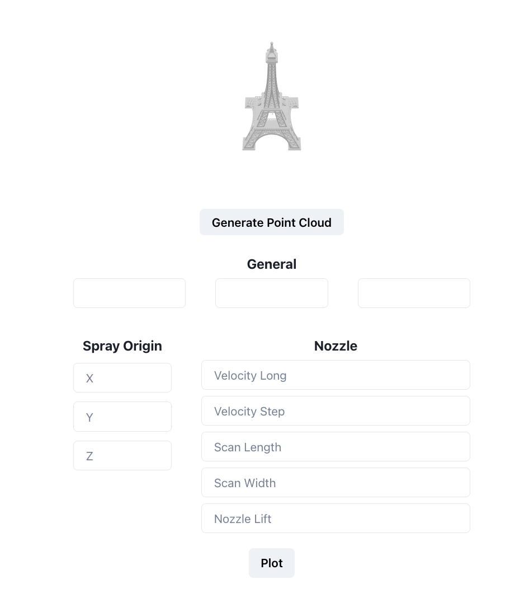

# KRI Website

(Project Still in Progress)

This website allows mechanical engineers to model 3D stl files and apply different
types of fixes like filling in a hole. These fixes are calculated by a process of backend
functions created by Northeastern mechanical engineering Teaching Staff and Masters students.
These STL files are modeled using React-Three-Fiber (A React wrapper for Three.JS) to allow for
interaction with 3D messhes.

## Screenshots



## Run Locally

Clone the project

```bash
  git clone https://github.com/JCur24/Coldspray
```

Go to the project directory

```bash
  cd my-project
```

Install dependencies

```bash
  npm install
```

Start the server

```bash
  npm run dev
```

## Environment Variables

To run this project, you will need to add the following environment variables to your Next.Js.config file

`API_KEY`

`AUTH_DOMAIN`

`PROJECT_ID`

`STORAGE_BUCKET`

`MESSAGING_ID`

`APP_ID`

`MEASUREMENT_ID`

## Deployment

To run this project, you need to navigate to outer directory

```bash
  npm install
  npm run dev
```

## Tech Stack

**Client:** Next.JS, React-Three Fiber, Chakra-UI,

**Server (Not Shown -- Private):** Python, Django

## Used By

This project is used by the following companies:

- KRI Institute at Northeastern University
